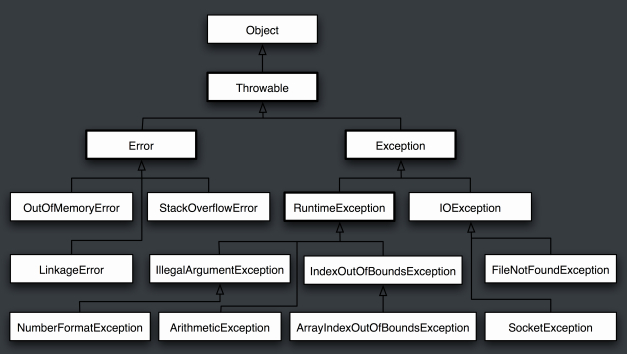

# 异常

Throwable 可以⽤来表示任何可以作为异常抛出的类，分为两种： Error 和 Exception。其中 Error⽤来表示 JVM ⽆法处理的错误，Exception 分为两种：

- 受检异常 ：需要⽤ try...catch... 语句捕获并进⾏处理，并且可以从异常中恢复；
- ⾮受检异常 ：是程序运⾏时错误，例如除 0 会引发 Arithmetic Exception，此时程序崩溃并且⽆法恢复。

[Java入门之异常处理](https://www.cnblogs.com/Blue-Keroro/p/8875898.html)