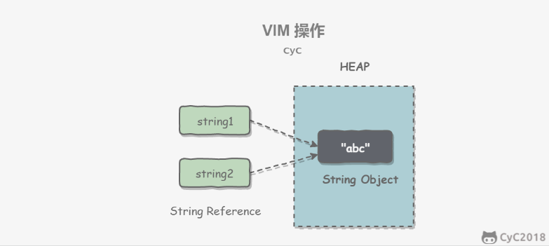

# String
----

## 概览

String 被声明为 final，因此它不不可被继承。(Integer 等包装类也不不能被继承）
在 Java 8 中，String 内部使⽤用 char 数组存储数据。

```java
public final class String
    implements java.io.Serializable, Comparable<String>, CharSequence {
    /** The value is used for character storage. */
    private final char value[];
}
```

在 Java 9 之后，String 类的实现改⽤用 byte 数组存储字符串串，同时使⽤用 coder  来标识使⽤用了了哪种编
码。

```java
public final class String
    implements java.io.Serializable, Comparable<String>, CharSequence {
    /** The value is used for character storage. */
    private final byte[] value;
 
    /** The identifier of the encoding used to encode the bytes in {@code 
value}. */
    private final byte coder;
}
```

在 Java 9 之后，String 类的实现改⽤用 byte 数组存储字符串串，同时使⽤用 coder  来标识使⽤用了了哪种编
码。
value 数组被声明为 final，这意味着 value 数组初始化之后就不不能再引⽤用其它数组。并且 String 内部没
有改变 value 数组的⽅方法，因此可以保证 String 不不可变。

## 不可变的好处

### 1. 可以缓存 hash 值
   
因为 String 的 hash 值经常被使⽤用，例例如 String ⽤用做 HashMap 的 key。不不可变的特性可以使得 hash 
值也不不可变，因此只需要进⾏行行⼀一次计算。

### 2. String Pool 的需要

如果⼀一个 String 对象已经被创建过了了，那么就会从 String Pool 中取得引⽤用。只有 String 是不不可变的，
才可能使⽤用 String Pool。



### 3. 安全性

String 经常作为参数，String 不不可变性可以保证参数不不可变。例例如在作为⽹网络连接参数的情况下如果 
String 是可变的，那么在⽹网络连接过程中，String 被改变，改变 String 的那⼀一⽅方以为现在连接的是其它
主机，⽽而实际情况却不不⼀一定是。

### 4. 线程安全

String 不不可变性天⽣生具备线程安全，可以在多个线程中安全地使⽤用。
Program Creek : Why String is immutable in Java?

## String, StringBuffer and StringBuilder

### 1. 可变性  
String 不不可变
StringBuffer 和 StringBuilder 可变
### 2. 线程安全  
String 不不可变，因此是线程安全的
StringBuilder 不不是线程安全的
StringBuffer 是线程安全的，内部使⽤用 synchronized 进⾏行行同步

## String Pool

字符串串常量量池（String Pool）保存着所有字符串串字⾯面量量（literal strings），这些字⾯面量量在编译时期就确
定。不不仅如此，还可以使⽤用 String 的 intern() ⽅方法在运⾏行行过程将字符串串添加到 String Pool 中。
当⼀一个字符串串调⽤用 intern() ⽅方法时，如果 String Pool 中已经存在⼀一个字符串串和该字符串串值相等（使⽤用 
equals() ⽅方法进⾏行行确定），那么就会返回 String Pool 中字符串串的引⽤用；否则，就会在 String Pool 中添
加⼀一个新的字符串串，并返回这个新字符串串的引⽤用。
下⾯面示例例中，s1 和 s2 采⽤用 new String() 的⽅方式新建了了两个不不同字符串串，⽽而 s3 和 s4 是通过 s1.intern() 
和 s2.intern() ⽅方法取得同⼀一个字符串串引⽤用。intern() ⾸首先把 "aaa" 放到 String Pool 中，然后返回这个字
符串串引⽤用，因此 s3 和 s4 引⽤用的是同⼀一个字符串串

```java
String s1 = new String("aaa");
String s2 = new String("aaa");
System.out.println(s1 == s2);           // false
String s3 = s1.intern();
String s4 = s2.intern();
System.out.println(s3 == s4);           // true
```

如果是采⽤用 "bbb" 这种字⾯面量量的形式创建字符串串，会⾃自动地将字符串串放⼊入 String Pool 中。

```java
String s5 = "bbb";
String s6 = "bbb";
System.out.println(s5 == s6);  // true
```

在 Java 7 之前，String Pool 被放在运⾏行行时常量量池中，它属于永久代。⽽而在 Java 7，String Pool 被移到
堆中。这是因为永久代的空间有限，在⼤大量量使⽤用字符串串的场景下会导致 OutOfMemoryError 错误。

## new String("abc") 

使⽤用这种⽅方式⼀一共会创建两个字符串串对象（前提是 String Pool 中还没有 "abc" 字符串串对象）。
- "abc" 属于字符串串字⾯面量量，因此编译时期会在 String Pool 中创建⼀一个字符串串对象，指向这个 "abc" 
字符串串字⾯面量量；
- ⽽而使⽤用 new 的⽅方式会在堆中创建⼀一个字符串串对象。

创建⼀一个测试类，其 main ⽅方法中使⽤用这种⽅方式来创建字符串串对象。
```java
public class NewStringTest {
    public static void main(String[] args) {
        String s = new String("abc");
    }
}
```

使⽤用 javap -verbose 进⾏行行反编译，得到以下内容：
```java
// ...
Constant pool:
// ...
   #2 = Class              #18            // java/lang/String
   #3 = String             #19            // abc
// ...
  #18 = Utf8               java/lang/String
  #19 = Utf8               abc
// ...
 
  public static void main(java.lang.String[]);
    descriptor: ([Ljava/lang/String;)V
    flags: ACC_PUBLIC, ACC_STATIC
    Code:
      stack=3, locals=2, args_size=1
         0: new           #2                  // class java/lang/String
         3: dup
         4: ldc           #3                  // String abc
         6: invokespecial #4                  // Method java/lang/String."
<init>":(Ljava/lang/String;)V
         9: astore_1
// ...
```

在 Constant Pool 中，#19 存储这字符串串字⾯面量量 "abc"，#3 是 String Pool 的字符串串对象，它指向 #19 
这个字符串串字⾯面量量。在 main ⽅方法中，0: ⾏行行使⽤用 new #2 在堆中创建⼀一个字符串串对象，并且使⽤用 ldc #3 
将 String Pool 中的字符串串对象作为 String 构造函数的参数。
以下是 String 构造函数的源码，可以看到，在将⼀一个字符串串对象作为另⼀一个字符串串对象的构造函数参数
时，并不不会完全复制 value 数组内容，⽽而是都会指向同⼀一个 value 数组。

```java
public String(String original) {
    this.value = original.value;
    this.hash = original.hash;
}
```